# Gallery

Regenerate these SVGs with `scripts/generate-published-figures`. Most fixtures
live in `test/svg_path_gallery_test.gleam`; the production arrangement capture
and concurrent runner are described in [WORKFLOW.md](WORKFLOW.md).

### Stroke Caps

Shows the same open cubic stroked with butt, square, and round caps.

### Dashed Strokes

Shows SVG-style dash extraction followed by geometric stroking with round caps.

### Recursive Dashes

Shows a dashed stroke whose individual dash outlines are dashed and stroked
again at a smaller scale.

### Stretched Figure-Eight Bands

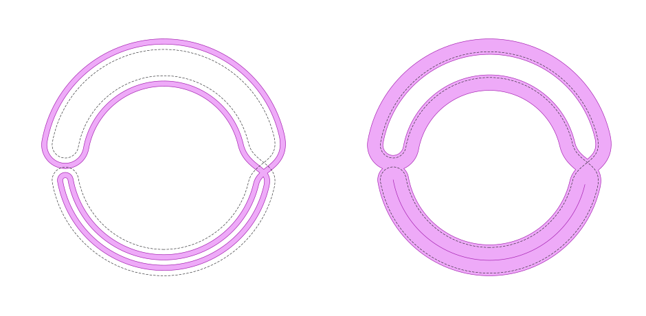

Compares a narrower band lying entirely on its positive-offset side (`+10` to
`+20`, left) with a wide band crossing both sides of the source (`−5` to `+25`,
right).

### Figure-Eight Correspondence Blocks

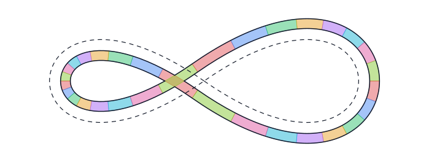

Shows the per-segment correspondence blocks between the untrimmed inner and
outer offset walks of the asymmetric figure-eight band.

### Figure-Eight Convex Hulls

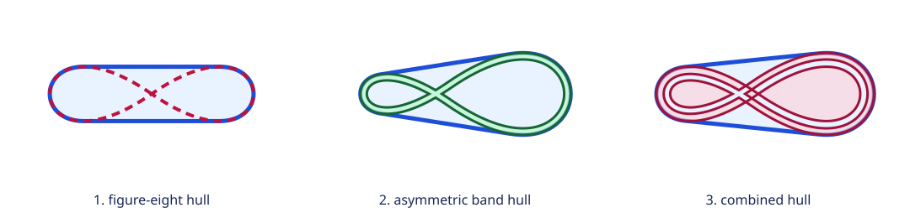

Compares the convex hulls of the Gallery figure-eight, its asymmetric band,
and the source and band taken together. These three cases are also numerical
regression fixtures for the convex-hull implementation.

### Stroke Offset Tracks

Shows one open subpath and several one-sided untrimmed offsets in different
colors.

### Earth-Tone Offsets

Shows three one-sided offset studies with each panel centered from the computed
geometry bounds.

### Package Title First Offset

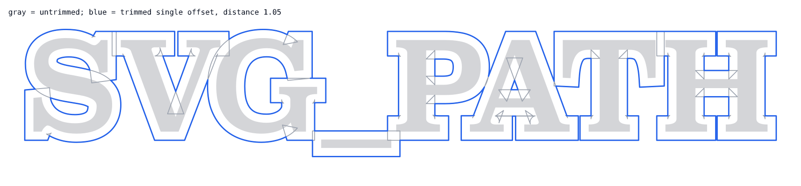

Shows the package title outline, its untrimmed single offset, and the trimmed
single offset used to stress arrangement-based offset pruning.

### Package Title Second Offset Arrangement

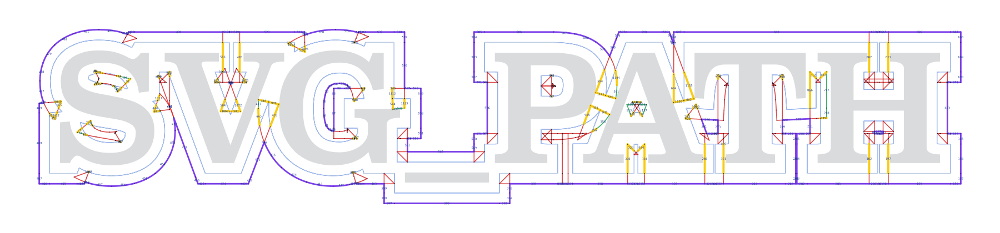

Shows the full second-offset arrangement graph for two successive `1.05` offsets
of the package title, using `Miter(4)`. The first offset uses default options;
the second disables offside trimming so the drawing includes geometry that
would otherwise disappear before the final in-band trimming stage. The graph
and pruning results are captured from the production pipeline using Erlang
runtime tracing, not a separate implementation of trimming.

Red marks initially submerged offset edges; purple marks edges retaining
positive final capacity. Yellow marks deleted edges already dangling immediately
after submerged deletion (the original figure's first-round meaning). Green
denotes other initially retained edges subsequently deleted, and pale gray
denotes source-only graph edges.
The original lettering is pale gray and its first offset is blue.

### Offset Text

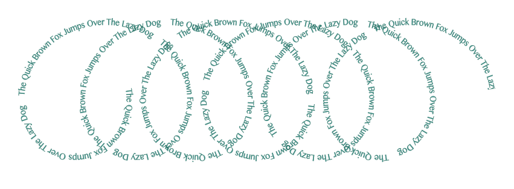

Maps a path extracted from an SVG text sample into `(distance, offset)` space
and then onto a fixed-radius coil with `offset.subpath_offset_map`.

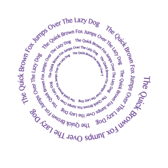

Uses the same text sample on a decaying spiral, with both radius and local
offset shrinking by the same factor per turn.

### Package Title Nine Offsets

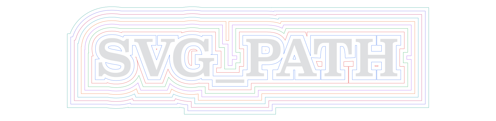

Nine successive `offset.path` rings, each spaced 1.04 from the previous ring,
pushed outward from the `SVG_PATH` text outline.

### Cut Radiator

Shows a dense snaking subpath cut by a text outline, with the pieces inside the
outline removed.
### ArrangementGraph Intersection Studies

Each sheet shows the source operands, their shared arrangement graph, and the
reconstructed intersection boundary.

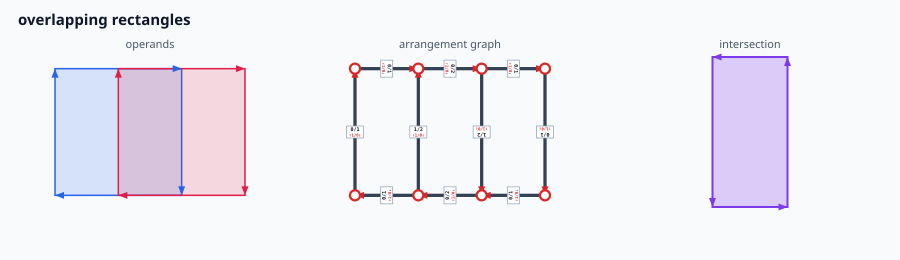

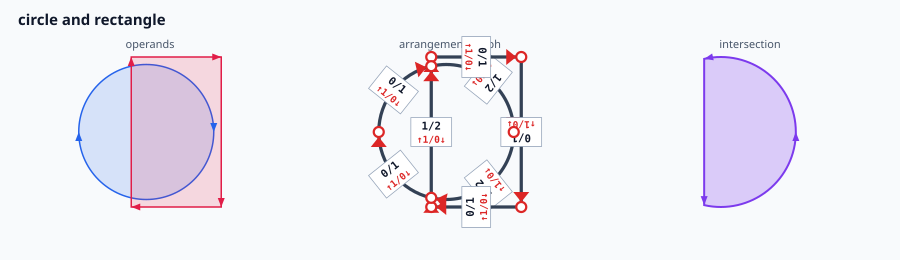

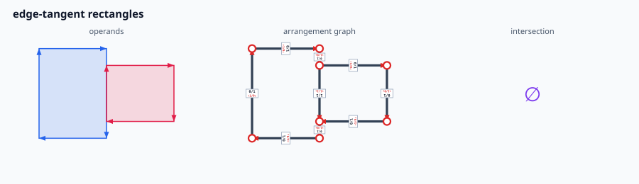

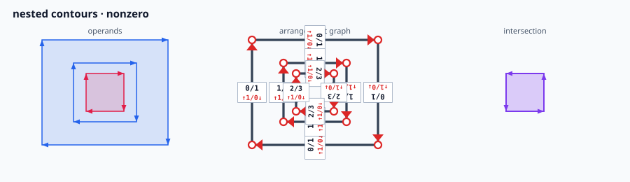

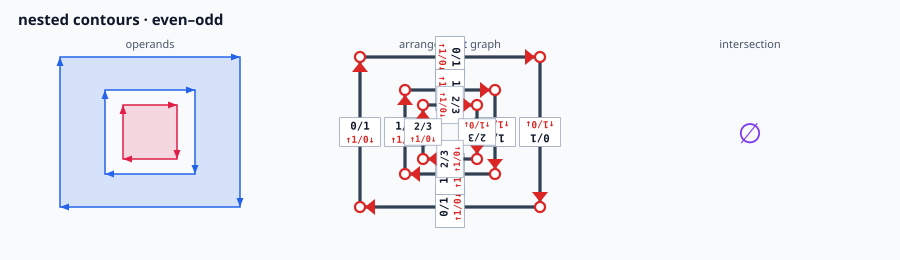

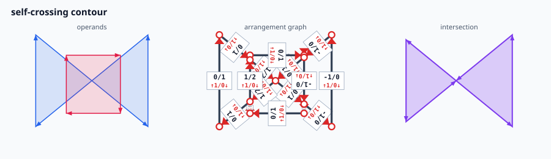

### ArrangementGraph Difference Studies

These use the same three-panel format for subtraction, including holes,
nested fill-rule cases, mixed curves, and self-crossing input.

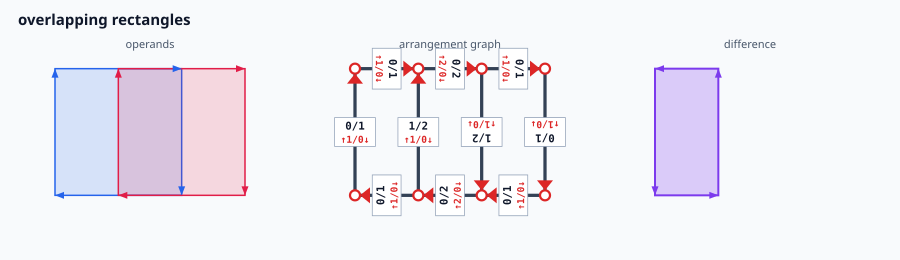

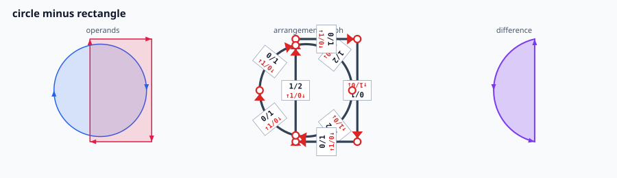

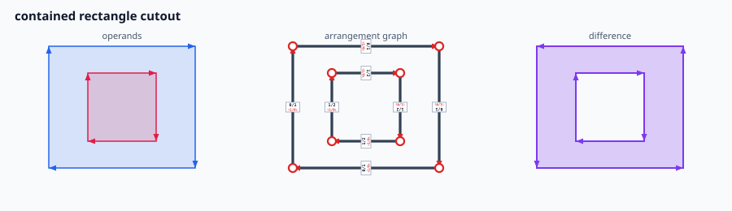

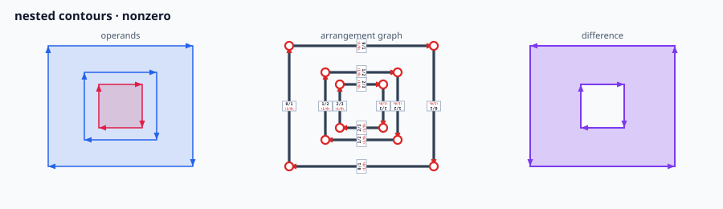

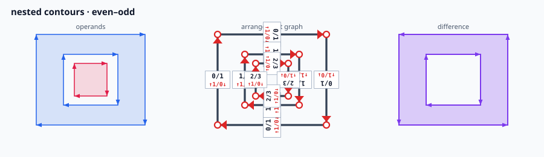

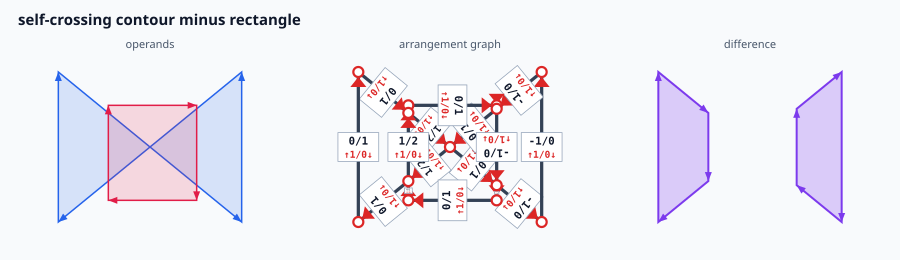

### Historical SVG 2 Join Comparisons

These compare our public `stroke.subpath` output (blue outlines) with the
[published SVG 2 illustrations](https://www.w3.org/TR/SVG2/painting.html#LineJoinShape).
The original reference drawings are retained alongside or beneath the output;
their geometry is not substituted for the computed outlines.

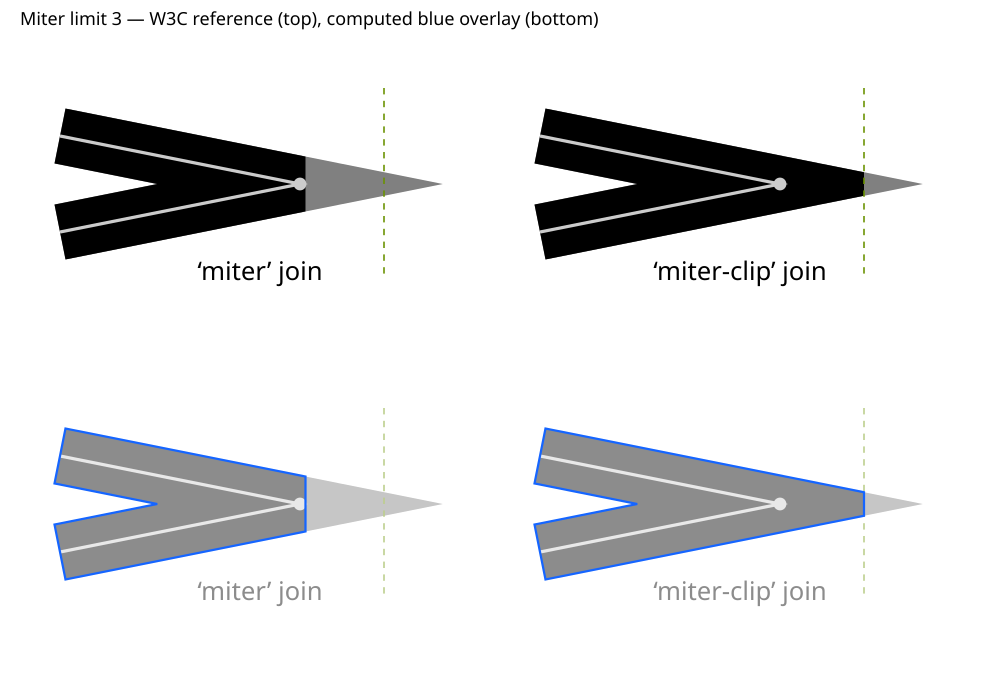

For stroke width 35 and miter limit 3, `MiterClip` reaches the reference clip
plane at x=227.5 exactly. The generator asserts this value.

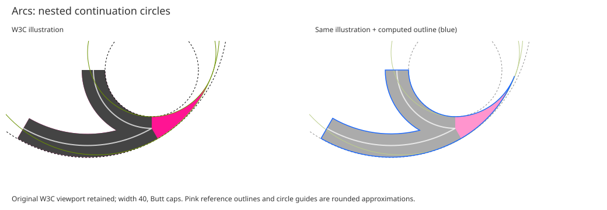

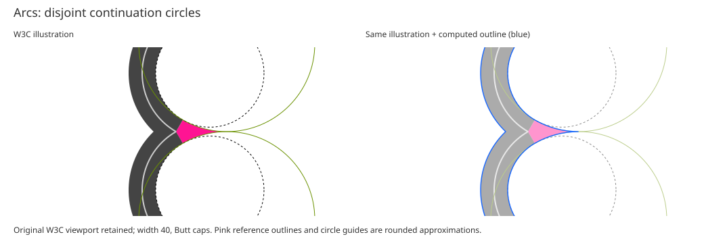

The arc illustrations use approximate outlines and rounded construction guides,
so they are visual checks, not exact numerical fixtures. For example, the
disjoint reference's pink tip is at x=323.85, its circle guides meet at x=325,
and our computed tip is at x=324.635836.

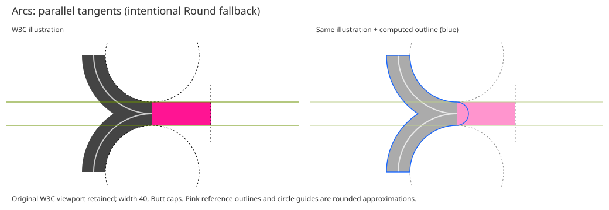

The parallel case deliberately differs: our signed-offset contract uses a
Round fallback rather than the proposal's rectangular extension.

`arcs` was adopted for SVG 2 in September 2012 and `miter-clip` in February
2015; both were removed from the editor's draft in March 2026. References,
reproduction details, and comparison limitations are recorded with the
[gallery fixture](scripts/gallery/w3c-join-reference/README.md).
