# Gallery

These SVGs are generated by `test/svg_path_gallery_test.gleam`.

### Rounded Rectangle Union

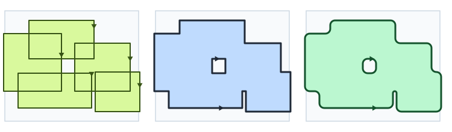

Shows a pile of overlapping rectangles, their raw `Nonzero` union, and the same
result after `effects.rounded_corners`.

### Stroke Caps

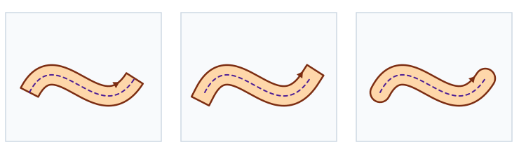

Shows the same open cubic stroked with butt, square, and round caps.

### Dashed Strokes

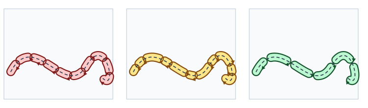

Shows SVG-style dash extraction followed by geometric stroking with round caps.

### Recursive Dashes

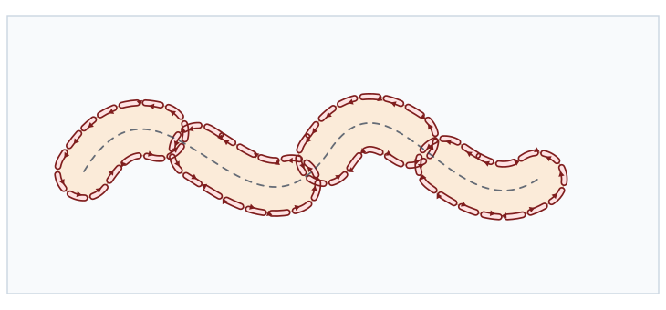

Shows a dashed stroke whose individual dash outlines are dashed and stroked
again at a smaller scale.

### Figure-Eight Band

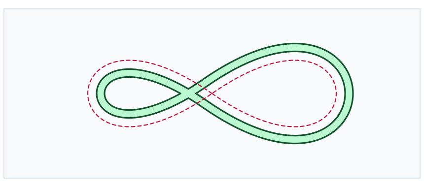

Shows an asymmetric two-sided band around a closed figure-eight.

### Stroke Offset Tracks

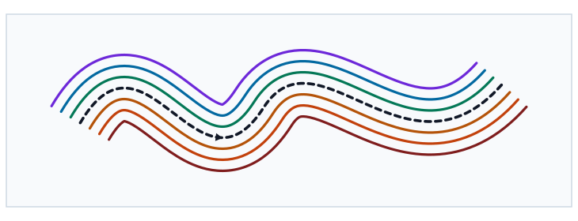

Shows one open subpath and several one-sided untrimmed offsets in different
colors.

### Earth-Tone Offsets

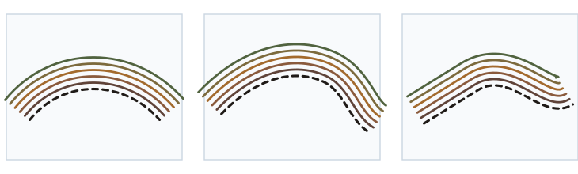

Shows three one-sided offset studies with each panel centered from the computed
geometry bounds.

### Stalled Offset Arc Turns

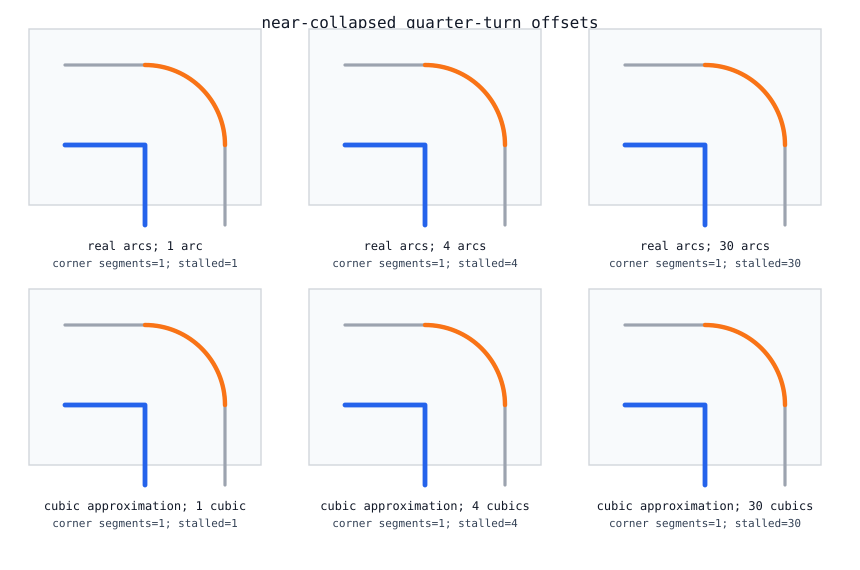

Compares near-collapsed quarter-turn offsets made from true circular arcs and
from cubic approximations, with `1`, `4`, and `30` pieces.

### Stalled Offset Corner Zoom

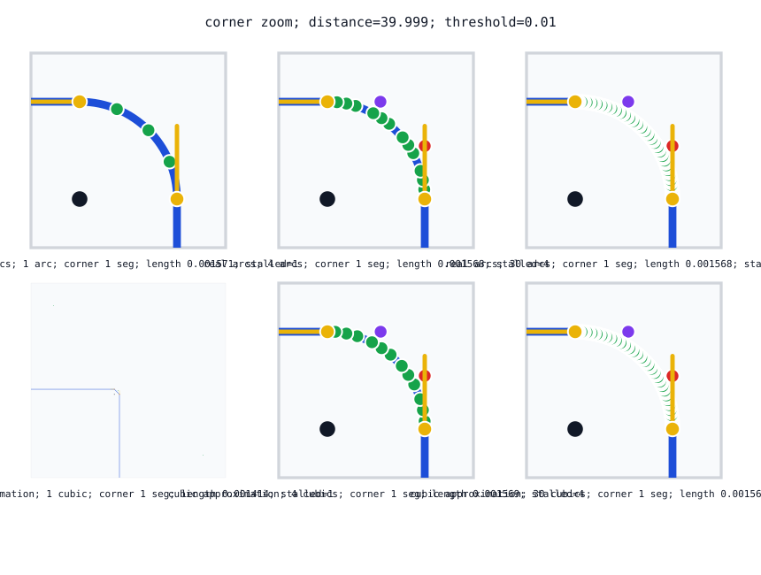

Zooms into the same six cases, showing offset samples, endpoint tangents, and
the fitted or exact corner replacement.

### Khmer Offset Map Coil

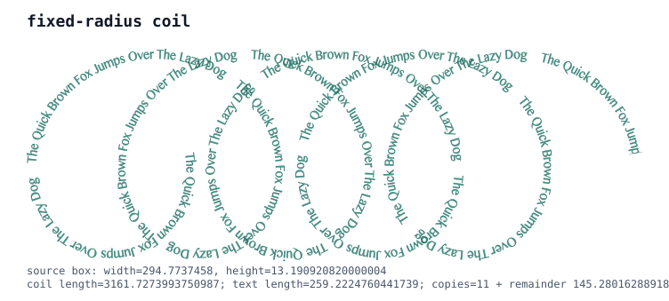

Maps a path extracted from an SVG text sample into `(distance, offset)` space
and then onto a fixed-radius coil with `offset.subpath_offset_map`.

### Khmer Offset Map Spiral

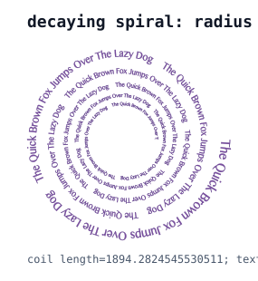

Uses the same text sample on a decaying spiral, with both radius and local
offset shrinking by the same factor per turn.

### Crescent Hull

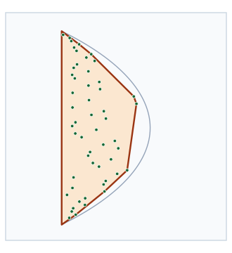

Shows a crescent-shaped point cloud, a reference arc and chord, and the computed
convex hull.

### Cut Radiator

Shows a dense snaking subpath cut by a text outline, with the pieces inside the
outline removed.

### Marker Pose Slots

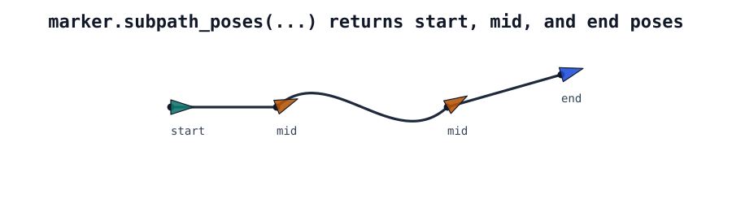

Shows the `MarkerStart`, `MarkerMid`, and `MarkerEnd` poses computed from a
single subpath.

### Marker Orientation Semantics

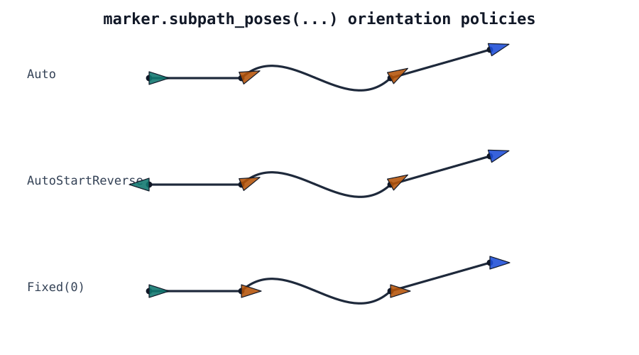

Compares `Auto`, `AutoStartReverse`, and a fixed marker orientation.

### Marker Reference Semantics

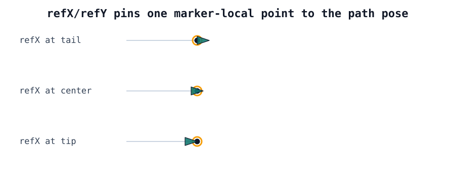

Shows how `refX` and `refY` choose which marker-local point lands on the path
pose.

### Marker Units Semantics

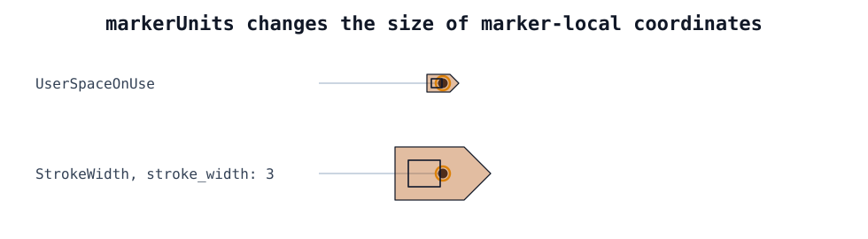

Shows the difference between marker-local `UserSpaceOnUse` units and
`StrokeWidth` units.

### Marker ViewBox Semantics

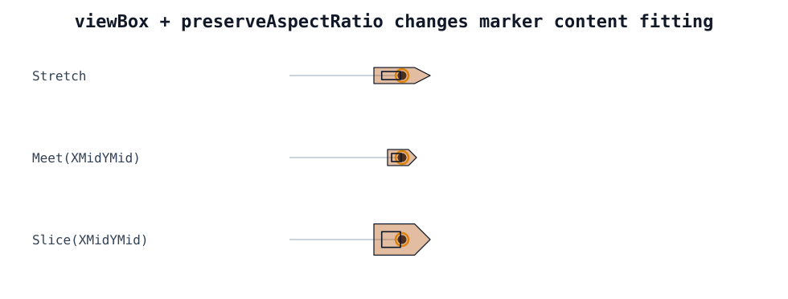

Compares the marker-local transforms for `Stretch`, `Meet`, and `Slice`
viewBox fitting. This figure shows transform semantics, not full marker
viewport clipping.
