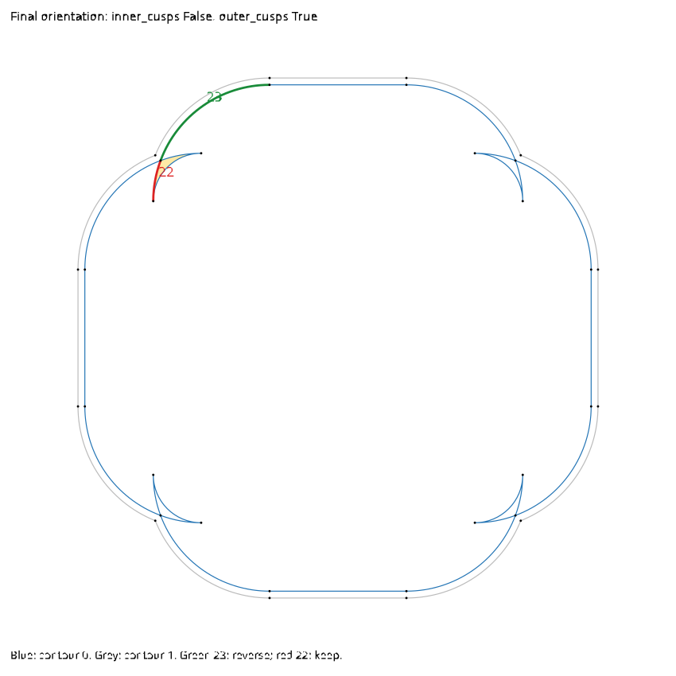

# Remaining audit issues

## Final band orientation refactor (B): revised signed-unit contract

The approved revision allows face values `-1, 0, 1`. An undecided contour
chooses `0 -> 1` or `nonzero -> 0`. Already-decided contours instead propagate
their fixed signed winding change, including transitions into negative faces.
Values outside the allowed range and disagreement with an assigned face remain
errors. Opposite same-contour preimages still cancel; other multiple-preimage
patterns remain unsupported. Traversal order is deterministic, without
backtracking.

`scripts/test-fast` passes 1,596 tests. The opposite-lobe test now verifies
successful orientation and idempotence; a new same-direction nested-lobe test
rejects winding magnitude two.
`gleam run -m svg_path_two_corner_square_bands_fixture` succeeds for all three trimming
configurations, including both configurations that failed under the former
0/1-only contract. The preview is
`examples/debug/four_concave_corner_square_band_trimming_comparison.svg`.

`escript examples/debug/final_orientation_checks.escript` also succeeds:
three square configurations, recursive dashes (67 orientation calls), figure
eight (one), and loop eight bands (two), with no orientation errors.

Part B is complete under this revised contract. The investigation below records the
superseded 0/1-only contract and its captured conflict for comparison.

### Historical 0/1-only implementation and diagnosis

`offset.orient_band_path` now takes only the reconstructed contour path. It
builds an AG from those contours and derives its dual; it no longer receives
the original winding-band callback or uses displaced midpoint probes.

The infinite face starts at zero. Every single-owner edge toggles the adjacent
face value between zero and one and decides (or verifies) its whole contour's
direction. Two opposite preimages from the same contour cancel, preserving the
face value without constraining that contour. Every other preimage pattern is
an explicit unexpected-edge error. Contradictory face/direction assignments and
unreachable faces are also errors. Fully retraced contours may remain undecided
and preserve their original traversal. A final pass validates every constraint.

Faces are scheduled only when first assigned; incident-edge lookup uses a
dictionary. The algorithm changes no segment geometry and does not alter
submerged classification or parity pruning. It runs only after in-band trimming;
the existing caller still reverses the whole band for reversed offset ordering.
Single offsets do not call it. Strokes inherit it through their band call.

`scripts/test-fast` passes 1,591 tests, including eight new orientation tests.
These cover nested contours in shuffled order, disjoint and vertex-touching
contours, fully retraced walks, attached retraced spurs, duplicate ownership,
same-loop same-direction repetition, contradictory lobe orientations, and
open/empty inputs.

`scripts/generate-published-figures` stops at
`svg_path_two_corner_square_bands_fixture`: `inner_cusps: False` yields
`ConstructionFailed` with either setting of `outer_cusps`. Both cusp trimmers
enabled succeeds. Independent tracing of actual orientation calls also checked
recursive dashes (67 calls), figure eight (one), and loop eight bands (two): no
orientation errors in those fixtures.

The first conflict is captured verbatim in
`examples/debug/orientation-square-outer-cusps.term`. On reconstructed contour
0, edge 23 separates faces 1 and 2 and requires reversal; edge 22 separates
faces 2 and 6 and requires retaining the original direction. Both edges have
one preimage, from that same contour, following the stored edge direction.
Signed winding propagation for contour 0 alone gives 0 on faces 0/1, 1 on
face 2, and 2 on faces 3–6. These are self-overlapping corner lobes, not a
whole-contour direction that can be corrected by reversal. The agreed 0/1
contract detects this; no fallback or splitting policy has been added.

Blue is captured contour 0; grey is contour 1. Green edge 23 requires reversing
contour 0, red edge 22 requires keeping it, and the pale-yellow region is actual
dual face 6. `examples/debug/final_orientation_conflict.escript` rebuilds the
same AG from the captured input and draws its edges/vertices. The broader
`final_orientation_checks.escript` records production calls without substituting
geometry. At this earlier checkpoint, B remained uncommitted pending a decision about these non-simple
contours: retain the strict error, or authorize a change beyond whole-contour
orientation (such as splitting). Published figures have not been promoted from
the failed generation run.

## Face-winding classification refactor (A): wired

`arrangement.face_windings` propagates caller-supplied signed edge changes over
an existing dual, seeding the infinite face at zero. Dual construction remains
independent. Inconsistent changes, missing assignments, and unreachable faces
return explicit errors. Tests cover nested orientations, overlaps, multiplicity,
empty graphs, open boundaries, cancellation, and cycle contradictions.

Classification graphs now include the exact assembled winding boundary.
Each winding segment occurrence is matched to one unused original segment
occurrence in either direction. Unmatched winding segments, including caps, are
appended with winding-only provenance, preserving the indices of original
preimages. Their expected-classification contribution is zero, but their actual
signed winding contribution is retained. Existing stroke caps already present
in the input outline are matched, not duplicated. Opposite coincident caps
remain separate occurrences and cancel through their signed contributions.

General submerged classification and side-local cusp classification now obtain
their measured side values from the propagated faces. The expected-versus-
measured comparison is unchanged. The old sampler remains for the explicit
comparison diagnostic; propagation errors are not caught and replaced by probes.
At the A checkpoint, algorithm B (final-loop orientation) and parity reduction
were unchanged. The subsequent B implementation is recorded above.

`scripts/test-fast` passes 1,580 tests. The diagnostic
`escript examples/debug/face_winding_comparison.escript` captures production
classification calls and compares both measurements and decisions. All 18
captures agree: figure-eight and concave-square bands, open bands with Butt,
RoundCap and Square caps in both offset orders and with negative offsets,
open single offsets of either sign with every cap style, and the first
lettering offset at 0.4. It verifies actual winding contributions rather than
inferring them from expected opinions.
`scripts/generate-published-figures` also completes: 9 README and 29 Gallery
figures regenerated, all byte-identical to the committed SVGs.
The five successive lettering offsets at 0.4 also succeed with unchanged
subpath counts (10, 13, 9, 10, 6) and an unchanged SVG.

### Follow-up: capped bands and shallow stroke delegation

Public open bands now submit the complete capped outline as output candidates,
with the same outline defining winding. Arbitrary winding-only boundaries in
the generic trimmer remain ineligible. Tests that expected capless open-band
results were corrected; a regression covers all three cap styles, both final
trimming modes, and both offset orders.

Nonzero strokes now call `offset.subpath_band_with` with symmetric offsets.
Duplicate stroke side construction, cap construction, trimming, and orientation
helpers were removed. The public stroke API is unchanged: it explicitly selects
no per-side cusp trimming and final in-band trimming, preserving its existing
policy. Zero-length stroke behavior and dash extraction remain in `stroke`.
An exact-result regression compares open and closed strokes against the public
band operation for every cap style. `scripts/test-fast` passes 1,582 tests.

`scripts/generate-published-figures` completes (9 README and 29 Gallery figures).
Only dashed-strokes and recursive-dashes SVGs change. Dashed-stroke outlines
retain their contour/cap counts but have additional cubic subdivision from
synchronized band construction. The recursive-dashes SVG has one additional
two-arc contour whose endpoints coincide at the displayed five-decimal
precision; no cleanup policy was added to suppress it. All other published
SVGs are byte-identical. The stroke module is 264 lines shorter.

The additional recursive-dash contour was subsequently traced to a discrepancy
between adjacent-loop culling and AG shared-endpoint sliver handling. Culling
rejected a hit near either endpoint; the AG rejects it only near both endpoints.
Culling now uses the same both-parameters condition and the AG builder shares
its `0.0001` constant. A regression using the exact arc/line pair fails before
the fix and passes afterward, including reversed traversal. The production
trace now retains join interval `[0, 0.999895513484253]` and line interval
`[7.905709238521863e-7, 1]`. The isolated final stroke has one closed contour;
the extra two-arc contour is gone. `scripts/test-fast` passes 1,583 tests.
Fresh previews: `examples/debug/recursive-dashes-current.svg` and
`examples/debug/recursive-dash-isolated-current.svg`.
The full published-figure generator was rerun after this fix: all 9 README
and 29 Gallery figures completed; current Gallery assets include the fix.
The separate solver endpoint-omission investigation remains saved in
`examples/debug/JOIN_LINE_MISSING_ENDPOINT.md`; this fix does not change the solver.

## Earlier audit record

Updated 2026-09-09, including the SP1 and OF3 follow-ups after `f57dd01`.

Gallery regeneration subsequently exposed and resolved an offset-map cumulative
length roundoff failure: subtracting a span's start from a valid cumulative
endpoint could exceed the stored segment length. The conversion is now clamped
to the selected span after strict global-distance validation. A regression
covers both an interior boundary and the final endpoint using lengths 10 and
0.3; it failed before the fix with `InvalidLengthDistance(0.3000000000000007, 0.3)`.
Both offset-text generators now run during Gallery generation instead of merely
copying their saved SVGs. The second-offset arrangement remains an explicitly
labeled archived diagnostic; reconnecting its original graph-capture generator
is still needed for fresh verification. The next two audit issues were deferred
to address this Gallery failure first.
`scripts/test-fast` passed **1,560 tests** with this fix.
`scripts/generate-published-figures` then completed: 28 freshly recomputed
Gallery figures, one explicitly archived arrangement figure, and nine README
figures. `xmllint --noout` accepted the Gallery files and staged chat previews.

The subsequent arrangement follow-up restored fresh generation of that final
Gallery entry. `scripts/gallery/package_title_arrangement.escript` traces the
actual production classification and capacity-reduction calls while running
the second `1.05` offset. It does not duplicate pruning algorithms or alter the
library. The initial capture was incorrectly taken after offside trimming.
The corrected diagnostic disables offside trimming only for the second offset,
capturing all 1,181 graph edges: 783 eligible offset edges, 471 initially
submerged, 103 initially dangling and deleted, 24 deleted later, and 185
retaining positive final capacity. Yellow uses the historical initially
degree-one/deleted meaning, not a serial capacity decrement. The original SVG
is archived at `docs/gallery/archive/second-offset-arrangement-2026-08-22.svg`.
The maintained fixture writes directly into `test/generated/gallery` and has
no dependency on that archived drawing.

AD1 and OF5 have now been resolved in `c2e8865` and `3bf9b2a`. Their illustrated
entries are retained below, explicitly marked resolved, as a record of this
follow-up. They are no longer candidates for further fixes.

TS1 and OF7 are also resolved, in `5ec5fd2` and `c91e527`, respectively.

This is the outstanding-work list extracted from
[V1_REVIEW_VISUAL.md](V1_REVIEW_VISUAL.md) (the existing visual review's filename).
Original issue IDs are retained for discussion. The original document and its
figures remain a historical record, not a statement of current behavior.

DE1, AG2, and AG3 are excluded: they were repaired in `7d37623`, `126e79c`,
and `8b43c68`, respectively. The related arrangement source-interval repair is
in `af898f9`. OF7's documentation corrections were already completed; only its
code-reachability question remains below.

This update checks the subsequent commits and current intersection/orientation
code. It does not rerun every historical reproducer. “Reproduced” below refers
to the evidence recorded in the visual review unless stated otherwise.

The drawings below are retained from that review, not regenerated against this
checkout. Blue denotes source/reference geometry, red the reported problem,
and green expected or comparison geometry. Some close-ups exaggerate one axis.
OF4, CH1, CH2, and OF7 use explanatory diagrams rather than public failing
geometry; the text distinguishes private probes and illustrative results from
public reproductions. The AG1/OF8 trial displacement is illustrative, not a
captured private probe. A drawing alone does not establish a reachable failure.

## Intersection search and classification

### IX2 — a found intersection does not exhaust its parameter window

**Module:** `svg_path/intersections`.
**Functions:** `window_preserving_search`, `window_preserving_inspect_window`,
`window_preserving_window_already_resolved`, and `insert_intersection`.
**Status:** unresolved; supporting improvements committed, residual-search
experiment shelved.

The original reproducer uses x=t and y=(t−0.2)(t−0.21)(t−0.22).
Intersecting it with a horizontal Line finds three crossings. Representing the
same horizontal geometry as a Quadratic selects the generic solver, which
misses crossings. See the [original illustration](examples/debug/v1_review_visuals/ix2.svg).

The current window-preserving solver still has two insufficient stopping rules:

- Finding an accepted candidate can finish the current window without proving
  that it contains no other intersection.
- `window_preserving_window_already_resolved` suppresses windows whose two
  parameter widths are at most 0.125 when an existing intersection lies within
  a margin of twice those widths. Proximity to a known hit is not uniqueness.

There are still two search algorithms: the window-preserving solver and the
older descent solver used as fallback on terminal-window exhaustion. The
crossing-based window search did not become a descent step inside the older
solver.

#### Improvements retained on main

- `46b3cd6`: crossing-root refinement validates the endpoint signs of its
  bracket. Unmatched endpoint root estimates can be rejected rather than
  being treated as certified crossings. This repair is in `svg_path.gleam`.
- `d49e170`: the window solver uses conservative polygonal enclosures after
  its bounding-box test. Bézier portions use control points; Arc portions use
  endpoint/tangent enclosures. Separation includes a floating-point allowance.
  A private switch retains the bounding-box-only mode; `EnclosingPolygons` is
  selected. Subdivision also avoids zero-width and unchanged children.

These changes improve rejection of empty windows and bracket handling. They
do **not** establish that a window containing a hit has been exhausted.

#### What is not active

The attempted residual-window search, partial-result fallback merging, and
associated candidate handling are preserved in
[IX2_EXPERIMENT.md](examples/debug/IX2_EXPERIMENT.md) and
[`ix2-residual-experiment.patch`](examples/debug/ix2-residual-experiment.patch).
The patch is against `af898f9`, not current main. Some independently committed
changes are also in that historical patch; do not apply it wholesale here.

That checkpoint had **1,539 passing tests and nine failures** under `gleam test`.
Problems included multiple numerical approximations of flat/tangent roots and
search exhaustion around accepted roots. The trial `1e-15` polishing threshold
was removed. The fixed parameter-exclusion box was not an adequate way to
identify a root and delimit its remaining uncertainty.

#### Remaining work

Retain found intersections while searching the residual parameter region,
without repeatedly rediscovering one approximate root or excluding a distinct
nearby root. Candidate refinement/deduplication and window exhaustion need
separate criteria. Test clustered crossings, touching roots, endpoint hits,
and fallback behavior together. IX4's position-only deduplication has now been
removed on the current solver, with the fast suite and second-offset fixture
passing. The archived residual-search experiment still needs its own checks
for multiple approximations of one root; IX4 does not resolve window exhaustion.

### IX3 — parallel tangents do not imply touching — resolved

**Module/function:** `svg_path/intersections.classify_directions`.
**Evidence:** reproduced classification error.

The cubic y=(t−0.5)^3 crosses a horizontal line at t=0.5, but the equal-tangent
branch labeled it `Touching` despite already obtaining the same outward-ray
order on both sides. For a common smooth tangent, those equal determinate
orders now produce `Crossing`; opposite orders retain `Touching`. Reversing
one traversal reverses the reported crossing direction. Corners/cusps do not
use this inference; open endpoints retain their separate classification.
Indeterminate samples retain the existing touching-order uncertainty.

The former test that expected `Touching` for the cubic now expects `Crossing`
and checks swapped operands and reversed traversal. It failed before the fix.
Existing parabola and kissing-circle tests still pass. `scripts/test-fast`
passes **1,565 tests**.

### IX4 — coincident positions can have distinct parameter pairs — resolved

**Module/function:** `svg_path/intersections.insert_intersection`.
**Evidence:** reproduced lost addresses; regression-tested repair.

A closed cubic can meet a line at both `(0,0.5)` and `(1,0.5)`. The old
deduplication merged hits when their positions agreed **or** both parameters
were close, losing one occurrence. Deduplication now requires both parameters
to be within the existing `1e-9` parameter tolerance. Endpoint preference is
preserved within such a duplicate pair. Geometric certification still uses
the caller's tolerance; only the unrelated position-based merging is removed.
A graph vertex may merge positions while retaining both preimages.

Two public regressions failed before the repair and pass afterward: a closed
cubic meeting a line at both endpoints (also with operands swapped), and a
retraced quadratic meeting a line at two interior parameters. Removed the
unused geometric deduplication tolerance and its private argument plumbing.
`scripts/test-fast` passes **1,565 tests**. The production second-offset
capture (`escript scripts/gallery/package_title_arrangement.escript`) succeeds
and its SVG is byte-identical to the published Gallery figure.

## Arrangement and offset topology/provenance

### AG1 — resolved: dual grouping no longer uses displaced probes

**Module/functions:** `svg_path/arrangement.dual_walk_candidates`,
`dual_sweep_intersections`, `dual_line_placements`.

Nested squares of side 10 separated by 0.00001 exposed a probe displacement of
chord×0.0001 that crossed the gap. The regression failed before the repair.
Dual construction now uses infinite-line sweeps through graph edges, not
containment samples or signed area:

- Partition by graph connectivity; retain each edge's two local boundary walks.
- Lines through a component establish its exterior walk from the first/last
  crossing and check the full sequence of intervening local faces.
- Lines targeting walks in disjoint components establish relative placement.
  Every accepted line contributes all the relationships it encounters.
- Sweep from infinity with one local face per component. The vector of local
  faces identifies a global face; matching vectors group boundary walks.
- Exterior walks become island boundaries, except that the all-exterior vector
  is the infinite face. Bounded local walks become enclosing boundaries.

Acceptance and confirmation are independent. Vertex-near lines, overlaps,
nontransverse/uncertain contacts, failed intersection calculations, and hits
too close to order are rejected before any conclusion is recorded. Tolerance
includes endpoint-cluster displacement and coordinate rounding allowance.
The existing algebraic supporting-line intersection solver is reused.
Deterministic pseudorandom proposals currently require two accepted lines per
conclusion, counting each walk only once per line. Conflicting accepted
conclusions and exhausted proposal budgets surface explicit internal errors
(the public API retains `ConstructionFailed`). The constants are private.

Public regressions cover the narrow-gap squares, several nested and separate
components, oppositely traversed nested circles, and a closed cubic containing
a disconnected bridge. The private production-helper harness
`escript examples/debug/dual_sweep_checks.escript` tests rejection, confirmation
counting, contradictions, and bounded exhaustion. No test-only sweep algorithm
or public debugging API was introduced.

Verification: `scripts/test-fast` passes **1,574 tests**, `scripts/test-slow`
passes **26 tests**, and the private sweep checks pass. The production
second-offset Gallery capture also succeeds; its SVG is byte-identical to the
published version (1,181 graph edges, 783 eligible, 471 initially submerged,
312 initially retained, and 185 with positive final capacity).

### OF8 — resolved: remove unnecessary nesting-based orientation

**Former module/functions:** `svg_path/offset.outline_contour_probe`,
`orient_outline_path`, and their private helpers.

The displaced interior probe could cross another contour and infer incorrect
nesting. Rather than replace that probe, we removed the unnecessary operation:
single offsets now return their reconstructed traversal, and strokes retain
the orientation already supplied by band construction. Both stroke branches
previously applied the nesting pass after band orientation. The unused nesting,
depth-counting, probe, and signed-area reversal helpers have now been deleted.

**Verification:** `scripts/test-all` passed with 1,574 fast tests and 26 slow
tests after removing the single-offset call. The added nested-counterclockwise
contour regression brings `scripts/test-fast` to 1,575 passing tests.
After removing the stroke calls, `scripts/generate-published-figures`
regenerated 9 README and 29 Gallery figures without further SVG changes.
The earlier single-offset removal changed only traversal in the rectangle and
umbrella fixtures; all Gallery figures remained byte-identical.

Five successive `0.4` lettering offsets also succeed, with subpath counts
10, 13, 9, 10, and 6. The repeatable public-API check is
`examples/debug/package_title_five_offsets_0_4.escript`.
The retraced C-shape regressions remain; they no longer need the removed
no-interior-probe exception.

### OF1 — resolved: reconstruction capacity included ineligible source occurrences

**Module/functions:** `svg_path/offset.retain_offset_image_edges`,
`offset_reconstruction_images`, `forced_parity_reduce_trim_graph`.
**Evidence:** zero-offset closed-square and duplicate-square regressions failed
before the fix with `ConstructionFailed`; an open-line control already passed.

At offset zero, source and offset share graph edges. Initial capacity counted
both, but reconstruction could consume only the eligible offset occurrences.
Capacities now count the same filtered source-image occurrences that
reconstruction visits. The pruning adapter respects these explicit counts,
excluding submerged edges, while the full arrangement remains unchanged for
winding classification. Band trimming still derives capacity from all its
boundary occurrences. The capacity-consumed assertion remains in place.

Regressions cover both square orientations, an open line's endpoint demands,
and two coincident square traversals. The latter preserves total length 80,
guarding against incorrectly replacing every capacity by one.
Verification: `scripts/test-fast` passed **1,563 tests**. Both
`escript scripts/gallery/package_title_arrangement.escript` and
`gleam run -m svg_path_two_corner_square_bands_fixture` succeeded and left
their tracked generated outputs unchanged. Formatting and whitespace checks
passed.

### OF2 — resolved: a corner at the closing seam missed join construction

**Module/functions:** `svg_path/offset.split_join_free_portions`,
`mark_closed_join_free_portion`, `synchronized_join_correspondences`.
**Evidence:** reproduced dependence on the starting segment address.

The single-portion case now checks the last-to-first source tangent boundary
before marking the portion internally closed. A sharp seam remains an open
portion, so it is not incorrectly healed as a smooth boundary. The join
assembler now visits the closing boundary even with only one portion; smooth
coincident endpoints produce no additional join geometry.

A public untrimmed-offset regression covers both cyclic orderings of a Line
and CubicBezier with one smooth junction and one corner. Both must succeed,
remain closed, and contain exactly one Round join. The seam-at-corner case
failed before the fix. The illustration shows that former failure.
Verification: `scripts/test-fast` passed 1,554 tests in the combined OF2/CH1
worktree; `scripts/test-slow` passed its 26 additional tests.
The existing `closed_offset_preserves_corner_at_single_portion_seam_test`
was rerun successfully during the OF1 follow-up; no further OF2 code change
was needed.

### OF3 — resolved: closing alignment lost the first segment's edit

**Module/function:** `svg_path/offset.colinearize_source_tangent_policy`.
**Evidence:** reproduced private normalization difference at the seam.

The source normalizer now aligns the last-to-first boundary explicitly before
rebuilding the ordinary interior boundaries. Both edited endpoint segments are
retained. For a single closed cubic, the start-handle and end-handle edits are
combined into that one segment. Final closure uses Strict; the public Custom
contract is unchanged, and no extra segment is appended.

Two public normalization regressions failed before the fix: one checks all
three cyclic orderings of a Cubic/Line/Line source and preservation of its
start and closedness; the other checks both endpoint directions of a single
closed cubic. The original drawing depicts the discarded first-handle edit.

### OF4 — resolved: reversed survivor parameter orientation

**Module/function:** `svg_path/offset.reverse_survivor_edges`.
**Evidence:** private-helper and downstream conversion regression; no public
offset fixture was needed to demonstrate the parameter-mapping error.

Reversing a survivor now also reverses its arrangement-split section geometry,
endpoint vertices, and directed H interval. The immutable I/H preimages and the
independent geometric REVERSED flag are unchanged. Both offside and cusp output
conversions therefore receive the correctly oriented interval without needing
separate reversal logic. Double reversal restores the original metadata.

`node examples/debug/survivor_provenance_regression.mjs` passes seven private
production-helper cases, covering both geometric REVERSED states, both output
conversions, later local-to-H parameter mapping, double reversal, and a survivor
without traced provenance. Before the fix it reproduced the wrong interval.
Build JavaScript first as described for the cusp regression. The illustration
depicts the old mismatch using explanatory parameter values.

### OF5 — resolved: complete erasure after parity

**Module/function:** `svg_path/offset.finish_cusp_trim_with_parity`.
**Evidence:** controlled internal-state reproducer.

Previously, no retained geometry before parity gave `Ok(None)`, but parity
erasing the last edge gave `InternalIToKSubpathCount(0)`. Commit `3bf9b2a` makes
both cases return `Ok(None)`, preserving errors for multiple chains and invalid
sole-chain topology. The drawing illustrates the old behavior.

`node examples/debug/cusp_empty_regression.mjs` passes 17 controlled private
finisher cases: empty input, every contiguous proper portion of a four-edge
square, and the complete surviving square. Build JavaScript first using
`(cd examples/public_api_smoke && gleam build --target javascript)`.
The harness exposes the production finisher in memory without replacing its
logic or adding public API. This is not a newly found public winding fixture.

### OF6 — resolved: collapsed-handle constraints checked lines rather than signed rays

**Module/functions:** `svg_path/offset.stalled_start_control2`,
`stalled_end_control1`, including their bisection fallbacks.
**Evidence:** reproduced synthetic private-fit violation, not a full offset.

A candidate could satisfy collinearity and handle length while pointing opposite
the requested one-sided direction. Both collapsed-handle fitters now validate
the returned cubic's actual one-sided endpoint directions against the requested
directions. This common final check covers direct, parallel-fit, and bisection
branches, including higher-derivative directions at collapsed handles. A wrong
ray returns fitting failure through the existing error/refinement path.

`examples/debug/collapsed_handle_rays.escript` tests the actual compiled private
fitters with exports enabled only in memory. Its 12 cases cover correct rays,
each wrong endpoint separately, both wrong, and forward/backward parallel
constraints for both collapsed endpoints. The wrong-ray case failed before
the fix; all 12 now pass. `scripts/test-fast` passed **1,563 tests**.

### OF7 — resolved: unused fitting alternatives

**Module/functions:** `svg_path/offset.e_join_free_endpoint_policy`,
`fit_offset_cubic_data_with_endpoint_policies`.
**Status:** reachability verified; dead alternatives removed.

The private policy's producer and collapsed-handle recovery never construct
`FitPositionOnly`. Removed that variant, its dispatch/direction branches, and
four exclusive fitting helpers (152 lines). The one-handle solvers and scalar
validation also serve active parallel-direction fallbacks and were retained.
This is dead-code removal, not a change to reachable fitting behavior. The
drawing describes the removed alternatives; documentation fixes were already done.

## Other public behavior and numerical contracts

### PA1 — resolved: drawing commands after closepath

**Module/functions:** `svg_path/parse.parse_close`, `ensure_active`.
**Evidence:** `M0 0L1 0ZL2 0` previously returned `ExpectedMove`.

The parser now requires a current point rather than an active subpath before
accepting a drawing command. Its existing append operation starts the new
subpath at the point retained after Z. Repeated Z is a no-op; a leading Z still
errors. Closepath continues to clear both smooth-control histories.

Three regressions cover all absolute/relative drawing command families, smooth
control reset, repeated Z, and a leading-Z error. They failed before the fix.
This follows [SVG closepath semantics](https://www.w3.org/TR/SVG/paths.html#PathDataClosePathCommand).
The illustration shows the former rejection and the intended continuation.

### SP1 — resolved: extrapolated directions inherited split-child orientation

**Module/function:** `svg_path.segment_directions_with`.
**Evidence:** reproduced on a Line outside t in [0,1].

For x=10t, the incoming direction at t=−1 and outgoing direction at t=2 pointed
backward. Polynomial segments outside [0,1] are now reparameterized over the
increasing interval [t−1,t+1], then evaluated at its interior midpoint using
the existing singularity-safe direction logic. This supplies genuinely opposite
sides of t, including at stationary points. Arc handling already uses its
derivative and is unchanged, as is all handling within [0,1].

Three regressions cover extrapolated Lines, quadratic stationary reversals,
and a cubic stationary point with no reversal. The Line and Cubic tests failed
before the fix; the Quadratic test guards existing correct behavior. The
illustration shows the old Line failure.
Verification in the combined SP1/OF3 worktree: `scripts/test-fast` passed
1,559 tests; `scripts/test-slow` passed 26 tests.

### TS1 — resolved: compact transform serialization discarded shear

**Module/functions:** `svg_path/transform/serialize.analyze_rotation_scale`,
`close_to_zero`.
**Evidence:** reproduced without requested decimal rounding.

A 1e-6 near-orthogonality threshold accepted a rotate/scale decomposition that
lost a real shear. The serializer now reconstructs all four coefficients and
accepts the decomposition only within a 1e-12 relative allowance per column;
otherwise it emits `matrix`. A regression covers positive/negative small shear
and scaled-up geometry. Existing pure-rotation and anisotropic-scale tests
continue to check compact output. The drawing illustrates the old behavior.

### ST1 — zero-length visible dashes lose their caps — resolved

**Module/functions:** `svg_path/stroke.dash_start`, `dash_intervals_loop`.
**Evidence:** reproduced empty output for [0,2] with Round caps; regression-tested repair.

Dash extraction now preserves zero-length visible events as open coincident-
endpoint Lines, including events at actual path-end pattern boundaries. A gap
clipped by the path end does not invent a new event there. Zero intervals are
handled explicitly, rather than passed through subpath-between logic that can
interpret equal closed-path addresses as a whole loop.

Round and Butt reuse the existing point-stroke handling. Located dash pieces
retain their original arc-length addresses internally so Square caps use the
source tangent (outgoing when available, otherwise incoming). Public dash
extraction still returns `List(Subpath)`; combined dashed-stroke APIs retain
the additional address until cap construction. Positive-length dashes continue
through ordinary stroke construction. No [1,0] coalescing policy was added.

Regressions cover all caps, phase shifts, endpoints, consecutive zero entries,
closed sources, and a diagonal source's Square-cap orientation, including the
path API. The [0,2] regression failed before the repair. The former test that
expected zero visible entries to disappear was corrected. `scripts/test-fast`
passes **1,569 tests**.

### AD1 — resolved: annotation sampling and containment tolerance mismatch

**Module/function:** `svg_path/arrangement/drawing.annotated_edge_things`.
**Evidence:** reproduced helper-level incorrect side labels.

Previously, samples displaced using drawing tolerance 1e-12 were tested with
default containment tolerance 1e-9. Commit `c2e8865` passes matching containment
options. This affects annotations, not arrangement topology; the drawing
illustrates the old mismatch. A public `annotated_drawing` regression checks
all four square-edge winding labels and failed before the repair.

### CH1 — resolved: minimum-width pruning used an unadjusted lower bound

**Module/function:** `svg_path/convex_hull.minimum_width_optimization_loop`.
**Evidence:** controlled late-stage search reproduced false convergence.

Interval pruning now subtracts the same rounding allowance used by the
convergence check. Thus exhaustion cannot bypass the allowance by discarding
an interval whose adjusted bound is still insufficient. Stored discarded bounds
remain raw and are adjusted at the existing reporting point, not twice.

`node examples/debug/width_pruning_roundoff_regression.mjs` passes four cases
using exact circle support geometry at two scales. It resumes a controlled
late-stage interval with a known bound for previously discarded regions.
A strict request previously reported convergence after discarding its last
interval; it now refines and reports unresolved at the supplied depth limit.
A coarse request still converges immediately. This is a private search-state
regression, not a claim of a newly reproduced public end-to-end hull failure.
Build JavaScript first as described for the other private regression scripts.
The original illustration remains a schematic of the old inconsistency.

### CH2 — hull tangent-root helpers assert success of fallible operations — resolved

**Module/functions:** `svg_path/convex_hull.cubic_point_tangent_roots`,
`refine_polynomial_tangent_isolation`.
**Status:** confirmed exhaustion in the production helper at extreme scale;
error propagation implemented.

Polynomial isolation on `[0,1]` reaches its fixed `1e-9` parameter tolerance
within about 30 bisections, comfortably inside the 100-step budget. However,
the subsequent geometric refinement has no equivalent scale-independent bound.
For `C(t)=3s(t,t²)`, `P=(0,-3sr²)`, `s=2^120`, and `r=2^-150`, the existing
helper panicked on `MaxIterationsReached` after 100 steps. This is a controlled
extreme-scale diagnostic, not a newly found ordinary-scale hull failure or a
claim that a complete public hull operation was made to reach this case.

The helper now returns `Error(TangentRootFailure(root_error))`, retaining the
estimate/value internally. Both point-tangent and chord-tangent construction
paths propagate this result; the public API retains its existing
`ConstructionFailed` mapping. Root budgets, tolerances, coefficients, and
successful results are unchanged. The two polynomial-isolation calls use the
same propagation instead of asserting success. Unrelated structural assertions
remain untouched.

The new regression exercises the original exhausting inputs and requires an
error rather than a panic. Existing successful internal-helper tests now unwrap
their `Result`s. `scripts/test-fast` passes **1,570 tests** and
`scripts/test-slow` passes **26 tests**.

## Verification baseline and next work

For SP1 and OF3, `scripts/test-fast` passed **1,559 tests** and
`scripts/test-slow` passed **26 tests**. Formatting and whitespace checks passed.

For OF2 and CH1, `scripts/test-fast` passed **1,554 tests** and
`scripts/test-slow` passed **26 tests**. The width-pruning private regression
passed **four cases**. Formatting and whitespace checks passed.

For PA1 and OF4, `scripts/test-fast` passed **1,553 tests**. The private survivor
provenance regression passed **seven cases**, and the private cusp-empty
regression still passed **17 cases**. Formatting and whitespace checks passed.

For TS1 and OF7, `scripts/test-fast` passed **1,550 tests**. The private cusp
finisher regression still passed its **17 cases**, and the two public C-offset
results were unchanged. Formatting and whitespace checks passed.

For the AD1 and OF5 follow-up, `scripts/test-fast` passed **1,549 tests** and
`node examples/debug/cusp_empty_regression.mjs` passed **17 cases**.
`gleam format --check src test` and `git diff --check` also passed.
No additional issue was repaired in this follow-up.

The C-shape fix and both regressions are committed in `6679aa6`.
`scripts/test-fast` passed with **1,548 tests** for that work. Before those two
tests, `scripts/test-all` passed with **1,546 ordinary tests and 26 slow tests**
on the retained intersection improvements. These are historical completed runs,
not a fresh verification performed while writing this document.

The remaining intersection search task is **IX2**. IX4's address/deduplication
repair is committed separately. IX3 is a separate classification problem.
The other entries remain available for separate fixes with their own regressions.
